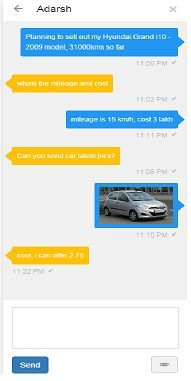

# Applozic-Web-Plugin

### Overview         

Open source Chat and Messaging SDK that lets you add real time chat and messaging in your mobile (android, iOS) applications and website.

Signup at https://www.applozic.com to get the application key.

Applozic One to One and Group Chat SDK

Features:

 One to one and Group Chat
 
 Image capture
 
 Photo sharing
 
 File attachment
 
 Location sharing
 
 Push notifications
 
 In-App notifications
 
 Online presence
 
 Last seen at 
 
 Unread message count
 
 Typing indicator
 
 Message sent, delivery report
 
 Offline messaging
 
 Multi Device sync
 
 Application to user messaging
 
 Customized chat bubble
 
 UI Customization Toolkit
 
 Cross Platform Support (iOS, Android & Web)

### Getting Started       

Applozic messaging jQuery plugin

A jQuery plugin to integrate messaging into your web page for real time communication between users via Applozic messaging platform and also to see your latest conversations and past chat history.Add Applozic messaging plugin into your web application :

Step 1: Register at https://www.applozic.com/ to get the application key.

Step 2: For the standard user interface, add the following Applozic messaging plugin script file before </head> into your web page:

     

Step 3: Copy and paste below script before </body> to initialize plugin:

     

Above options description :

      userId: 'UNIQUE USER ID OF ACTIVE USER'                                   // loggedIn user Id (required)   
      appId: 'YOUR APPLICATION KEY'                                             // obtained from Step 1 (required)     
      desktopNotification: true or false                                        // optional
      notificationIconLink : 'YOUR WEB APP LOGO'                                // required for desktop notifications (optional)
 
Note : desktopNotification support only for chrome browser, notificationIconLink will be display in desktop notifications

More details here: 
https://www.applozic.com/developers.html#applozic-web-plugin-getting-started

##Help

We provide support over at [StackOverflow] (http://stackoverflow.com/questions/tagged/applozic) when you tag using applozic, ask us anything.

Applozic is the best jquery chat plugin for instant messaging, still not convinced? Write to us at github@applozic.com and we will be happy to schedule a demo for you.

##Github projects

Android Chat SDK https://github.com/AppLozic/Applozic-Android-SDK

Web Chat Plugin https://github.com/AppLozic/Applozic-Web-Plugin

iOS Chat SDK https://github.com/AppLozic/Applozic-iOS-SDK
