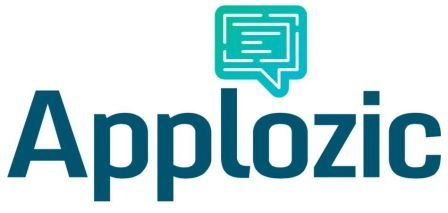

# Applozic-Web-Plugin


### Overview         

Open source Chat and Messaging SDK that lets you add real time chat and messaging in your mobile (android, iOS) applications and website.

Signup at https://www.applozic.com to get the application key.




Applozic One to One and Group Chat SDK

Features:


 One to one and Group Chat
 
 Image capture
 
 Photo sharing
 
 File attachment
 
 Location sharing
 
 Push notifications
 
 In-App notifications
 
 Online presence
 
 Last seen at 
 
 Unread message count
 
 Typing indicator
 
 Message sent, delivery report
 
 Offline messaging
 
 Multi Device sync
 
 Application to user messaging
 
 Customized chat bubble
 
 UI Customization Toolkit
 
 Cross Platform Support (iOS, Android & Web)


### Getting Started       

Applozic messaging jQuery plugin

A jQuery plugin to integrate messaging into your web page for real time communication between users via Applozic messaging platform and also to see your latest conversations and past chat history.Add Applozic messaging plugin into your web application :


### Overview      


Integrate messaging into your mobile apps and website without developing or maintaining any infrastructure. Sign up at https://www.applozic.com         


### Getting Started          


****Applozic messaging jQuery plugin****

Javascript chat and messaging plugin that lets you enable real time chat using websockets in your website without developing or maintaining any infrastructure.


Signup at [Applozic](https://www.applozic.com/signup.html) to get the application key.

#### Step 1: Add the Applozic Chat plugin script before ```</head>``` into your web page            

```
<script type="text/javascript">
   (function(d, m){var s, h;       
   s = document.createElement("script");
   s.type = "text/javascript";
   s.async=true;
   s.src="https://apps.applozic.com/sidebox.app";
   h=document.getElementsByTagName('head')[0];
   h.appendChild(s);
   window.applozic=m;
   m.init=function(t){m._globals=t;}})(document, window.applozic || {});
</script>
```
 
#### Step 2: Initialize Chat Plugin

``` 
<script type="text/javascript">
  window.applozic.init({appId: 'PUT_APPLICATION_KEY_HERE', userId: 'PUT_USERID_HERE', userName: 'PUT_USER_DISPLAYNAME_HERE', desktopNotification: true,  notificationIconLink: "PUT_LOGO_IMAGE_LINK_HERE"});
</script>
```    

It can also be called from any event, for example: on click of a button.

Above options description :-    

```
 appId: 'YOUR APPLICATION KEY'                         // obtained from Step 1 (required)    
 userId: 'UNIQUE USER ID OF ACTIVE USER'               // loggedIn user Id (required)  
 userName: 'ACTIVE USER DISPLAY NAME'                  // loggedIn user name (optional)  
 imageLink: 'ACTIVE USER IMAGE LINK'                   // loggedIn user image url (optional)          
 desktopNotification: true or false                    // optional
 notificationIconLink : 'YOUR WEB APP LOGO'            // required for desktop notification (optional)                             
```

**Note** : desktopNotification support only for chrome browser, notificationIconLink will be display in desktop notification


#### Step 3: More options with callback functions

```
 1) onInit : function(response) { 
        if (response === "success") {
           // plugin loaded successfully, perform your actions if any, for example: load contacts, getting unread message count, etc
        } else {
           // error in loading plugin (you can hide chat button or refresh page) 
        }
    }                      
    
  Callback function which gets triggered on plugin initialized. You can write your own logic inside this function to execute on plugin initialization. 
  
 2) contactDisplayName: function(userId) {  
          //return the display name of the user from your application code based on userId.
          return "";
    }                    
  Function should return USER_DISPLAY_NAME by taking USERID as input parameter. 
  
 3) contactDisplayImage: function(userId) {  
          //return the display image url of the user from your application code based on userId.
          return "";
    }                 
    
  Function should return USER_IMAGE_URL by taking USERID as a input parameter. 
  
 4) accessToken: 'PASS_USER_ACCESS_TOKEN_HERE'                            //Type - String (optional)    
 
 Access token is to authenticate user from your end. To enable access token authentication you have to configure authentication url in admin dashboard. 
 For more detail about access token, read :**https://www.applozic.com/app-config.html#authentication-url**.
```

Example of how to use above mentioned options:
```
     $applozic.fn.applozic({
       userId: USER_ID,
       appId: APPLICATION_KEY,
       onInit: function(response) { 
            if (response === "success") {
               // plugin loaded successfully, perform your actions if any, for example: load contacts, getting unread message count, etc
            } else {
               // error in loading plugin (you can hide chat button or refresh page) 
            }
        }
     });
```


#### Step 4: Contacts

Javascript code to load contacts

```
var CONTACT_LIST_JSON = 
          {"contacts": [{"userId": "USER_1", "displayName": "Devashish", 
                          "imageLink": "https://www.applozic.com/resources/images/applozic_icon.png"}, 
                        {"userId": "USER_2", "displayName": "Adarsh", 
                          "imageLink": "https://www.applozic.com/resources/images/applozic_icon.png"}, 
                        {"userId": "USER_3", "displayName": "Shanki",
                          "imageLink": "https://www.applozic.com/resources/images/applozic_icon.png"}
                        ]
         };  //Replace this with contacts json from your application
         

$applozic.fn.applozic('loadContacts', 'CONTACT_LIST_JSON');

```

**NOTE**- Call **loadContacts** function only after plugin initailize callback (see Step 4 for reference).


#### Step 5: Chat screen

Javascript to open chat box

```
 $applozic.fn.applozic('loadTab', '');  
 ``` 
 
Javascript to open chat with individual user

```
 $applozic.fn.applozic('loadTab', 'PUT_OTHER_USERID_HERE');  // user Id of other person with whom you want to open conversation 
 ``` 

Anchor tag or button to load(open) individual tab conversation directly

Add a chat button inside your web page using a tag and use 'userId' for data attribute "data-mck-id"   

```
<a href="#" class="applozic-launcher" data-mck-id="PUT_OTHER_USERID_HERE" data-mck-name="PUT_OTHER_USER_DISPLAY_NAME_HERE">CHAT BUTTON</a>
 ```        
 
 **Note** - Data attribute **mck-name** is optional in above tag          
 
 
 
#### Step 6: Send message


 ```
 var messageJson = 
          {"to":'USER_ID',                                 // required
           "message" : 'TEXT_MESSAGE'                      // required
        }; 
$applozic.fn.applozic('sendMessage', messageJson);
 ```


More details here: 
https://www.applozic.com/developers.html#applozic-web-plugin-getting-started


##Help

We provide support over at [StackOverflow] (http://stackoverflow.com/questions/tagged/applozic) when you tag using applozic, ask us anything.

Applozic is the best jquery chat plugin for instant messaging, still not convinced? Write to us at github@applozic.com and we will be happy to schedule a demo for you.

##Github projects

Android Chat SDK https://github.com/AppLozic/Applozic-Android-SDK

Web Chat Plugin https://github.com/AppLozic/Applozic-Web-Plugin

iOS Chat SDK https://github.com/AppLozic/Applozic-iOS-SDK
